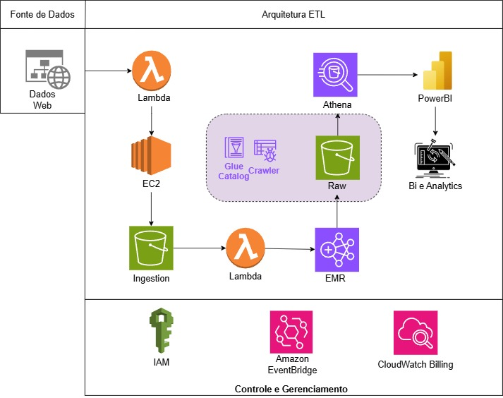

# Projeto de Extração de Dados - Cadastro Nacional da Pessoa Jurídica (CNPJ)

## Introdução
Este projeto visa a extração e utilização dos dados abertos do Cadastro Nacional da Pessoa Jurídica (CNPJ) disponibilizados no portal [dados.gov.br](https://dados.gov.br/dados/conjuntos-dados/cadastro-nacional-da-pessoa-juridica---cnpj) que são atualizados mensalmente.

## Objetivo
O objetivo deste projeto é adquirir os dados abertos referentes ao CNPJ de todas as empresas registradas no Brasil, tratá-los e organizá-los, deixando-os prontos para análises e visualizações de forma sempre atualizada. A solução abrange desde a extração dos dados da API pública até a preparação das informações para fácil acesso e exploração no Power BI.

## Arquitetura
A arquitetura escolhida para este projeto foi baseada na AWS (Amazon Web Services), que proporciona uma solução escalável e eficiente para o processamento e armazenamento dos dados.

- **AWS Lambda**: Realiza o acionamento da EC2 para extração dos dados quando é identificado dados novos e aciona o EMR para processar os dados depois de baixados.
- **EC2**: Realiza a extração dos dados após acionamento pela Lambda.
- **EMR**: Processa os dados, adiciona a tipagem, cruzamento de tabelas, limpeza e armazena em parquet particionados pela data de processamento.
- **Amazon EventBridge**: Faz o acionamento das Funções Lambdas. Na primeira ele programa a Lambda para verificar a url do site de 3 em 3 dias. Na segunda ele cria um gatilho de encerramento da EC2 de extração e manda para a Lambda.
- **Amazon S3**: Utilizado para o armazenamento dos dados brutos extraídos e os dados tratados prontos para consumo.
- **AWS Glue Catalog e Crawler**: Utilizado para catalogação dos dados para localização no Athena.
- **Athena**: Utizado para realizar consultas SQL nos dados parquet e integra-los ao PowerBI.
- **Power BI**: Ferramenta utilizada para visualização e análise dos dados extraídos, permitindo uma análise interativa e customizada dos CNPJs de todo o Brasil.
- **IAM** : Faz o controle de acessos e permissões.
- **CloudWatch Billing**: Cria alarmes para controle de Custos.

## Funcionalidades

- **Extração de Dados**: Coleta os dados abertos do Cadastro Nacional da Pessoa Jurídica (CNPJ) via API pública.
- **Transformação**: Após a extração, os dados passam por um processo de limpeza, transformação e normalização para garantir que estejam estruturados corretamente para consumo.
- **Carga**: Os dados tratados são armazenados no Amazon S3 e disponibilizados para consumo via Power BI.
- **Visualização**: O Power BI é usado para criar dashboards interativos e informativos, com gráficos e tabelas que ajudam na análise e visualização dos dados.

## Bibliotecas Utilizadas

- **PySpark**: Orquestração e execução das funções de ETL.
- **datetime**: Manipulação e formatação de datas e horários.
- **boto3**: Automação de processos ETL e interação com os serviços da AWS.
- **bs4 (BeautifulSoup4)**: Análise e extração de dados de arquivos HTML.
- **requests**: Realização de requisições HTTP para consumo de APIs.
- **time**: Manipulação e controle de tempo durante o processamento.
- **json**: Leitura e gravação de arquivos no formato JSON.
- **logging**: Registro e monitoramento de logs durante a execução do projeto.
- **os**: Interação com o sistema operacional para manipulação de arquivos e diretórios.
- **zipfile**: Manipulação de arquivos ZIP.
- **io**: Manipulação de entradas e saídas de dados em memória.
- **concurrent.futures**: Execução paralela de tarefas assíncronas.
- **os.path**: Manipulação de caminhos de arquivos no sistema operacional.

## PowerBI
Dashboard Final PowerBI:
